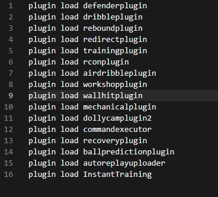
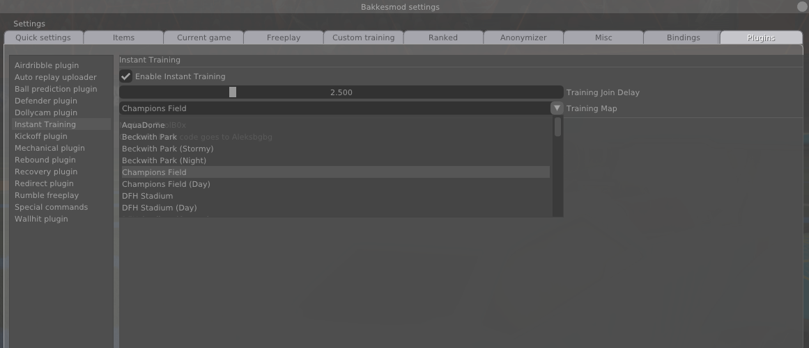

# Instant Training

This is the InstantTraining plugin for Rocket League, more specifically, BakkesMod. It immediately puts the player in training, as soon as a match is over.

## Installation

Compiled files are located in the `Release` directory.

Move `InstantTraining.dll` to `<steam_directory>\steamapps\common\rocketleague\Binaries\Win32\bakkesmod\plugins\` and `instanttraining.set` should be located in `<steam_directory>\steamapps\common\rocketleague\Binaries\Win32\bakkesmod\plugins\settings\`.

Open up `<steam_directory>\steamapps\common\rocketleague\Binaries\Win32\bakkesmod\cfg\plugins.cfg` with notepad or a similar text editing application. Append `plugin load InstantTraining` to the bottom of the file and save it. It should look something like this when you are done:

## Usage

Now the plugin will be loaded everytime you load Bakkesmod. You can easily edit the settings by going to the `Plugins` tab in BakkesMod. There you can edit the settings for the InstantTraining plugin.

## Features

- **Delay** - If you do not want to join freeplay instantly, you can set a custom delay (in seconds) to wait before joining
- **AutoGG Support** - If you use the built-in `Automatically say GG` feature, no need to worry, you will get your `GG` in before joining freeplay
- **Random Maps** - You can select "Random Map" to get a random map when you load into freeplay from the plugin.

## Planned

- ~~Automatic queue after exiting to training~~ (Bakkesmod needs additional functionality added to achieve this)
- Only join training after a specific type of game (Casual, Ranked, Extras) (WIP)

## Thanks

Special thanks to [Aleksbgbg](https://github.com/Aleksbgbg) for beating me to this and getting a base to work off of, and thanks to all the helpful guys in the BakkesMod discord!
